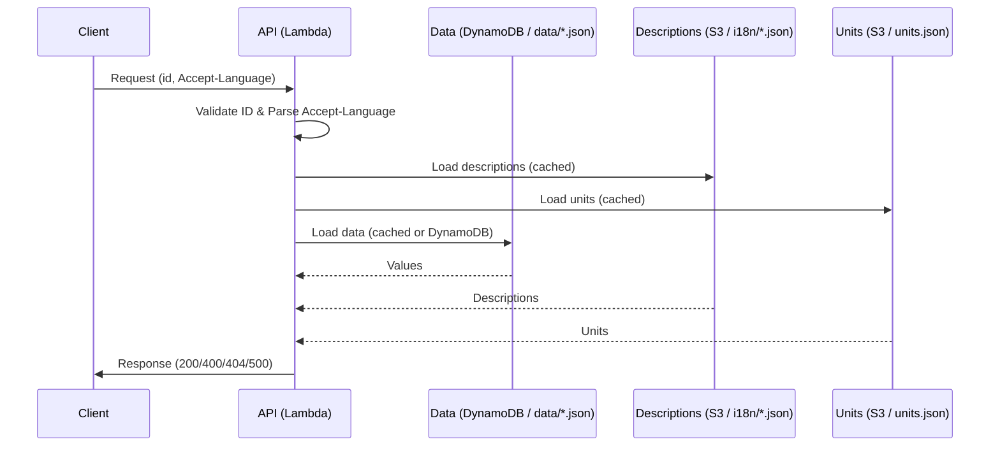

# API Language Test

This project demonstrates how API responses can be generated based on language preferences.  
It loads data, descriptions, and units from JSON files, supports multiple languages, and uses simple, thread-safe caching.

> **Note:** In this demo, data and translations are loaded directly from files for simplicity.  
> In a real API, data would typically come from a database (e.g. DynamoDB) and translations/units from a filestore such as S3.

---

## How it works

- **main.py**: Core logic for processing requests.
  - Accepts an item ID and an `Accept-Language` header.
  - **Strict item ID validation:** Only IDs with exactly 4 lowercase letters or digits are accepted. Invalid IDs return a 400 error.
  - **Language negotiation:** Parses the `Accept-Language` header according to RFC 9110, including support for `q` values.  
    - Entries with `q=0` are skipped.  
    - Header length and number of entries are capped for robustness.  
    - Matching order: exact language → base language (e.g. `de-CH` → `de`) → default language.
  - Loads data (`data/<id>.json`), descriptions (`i18n/<lang>.json`), and units (`units/units.json`).
  - Returns a structured response with attributes, values, units, and language-specific descriptions.
  - **Two layers of caching:**
    - **In-memory caches** inside the Lambda runtime: descriptions, units, and data (with bounded size, TTLs, and negative caching for missing IDs).
    - **HTTP caching headers**: responses include `Cache-Control`, `Vary`, and `Content-Language` for downstream caches (browsers, CDNs, API Gateway).
  - **Response headers:** All responses include  
    - `Content-Type`  
    - `Content-Language` (the chosen language)  
    - `Vary: Accept-Language` (so caches don’t mix languages)  
    - `Cache-Control` (default: `public, max-age=300`, meaning responses may be reused for up to 5 minutes).
  - **Key order:** The order of output attributes can be controlled via the environment variable `CANON_KEYS`.
  - **Error handling:**  
    - 400 and 404 errors include standard headers and a JSON body.  
    - 500 errors include a correlation ID for easier debugging. Stack traces are never leaked to clients.

- **i18n/*.json**: Language-specific descriptions for keys.
- **data/*.json**: Data objects with key-value pairs.
- **units/units.json**: Global unit mapping for keys.

---

## Example

A request with `item_id="id01"` and `Accept-Language="de-DE"` returns:

```json
{
  "statusCode": 200,
  "headers": {
    "Content-Type": "application/json",
    "Content-Language": "de",
    "Vary": "Accept-Language",
    "Cache-Control": "public, max-age=300"
  },
  "body": {
    "id": "id01",
    "language": "de",
    "list-attribute": [
      {
        "key": "key1",
        "description": "Beschreibung 1",
        "value": "value1",
        "unit": "m"
      },
      {
        "key": "key2",
        "description": "Beschreibung 2",
        "value": "value2",
        "unit": "kg"
      },
      {
        "key": "key3",
        "description": "Beschreibung 3",
        "value": "value3",
        "unit": null
      }
    ]
  }
}
```

If the item ID is invalid (e.g. `"bad!"`):

```json
{
  "statusCode": 400,
  "headers": {
    "Content-Type": "application/json",
    "Content-Language": "en",
    "Vary": "Accept-Language",
    "Cache-Control": "public, max-age=300"
  },
  "body": {
    "code": 400,
    "message": "invalid id: must be exactly 4 chars [a-z0-9]"
  }
}
```

If the item is not found:

```json
{
  "statusCode": 404,
  "headers": {
    "Content-Type": "application/json",
    "Content-Language": "en",
    "Vary": "Accept-Language",
    "Cache-Control": "public, max-age=300"
  },
  "body": {
    "code": 404,
    "message": "not found"
  }
}
```

If an internal error occurs:

```json
{
  "statusCode": 500,
  "headers": {
    "Content-Type": "application/json",
    "Content-Language": "en",
    "Vary": "Accept-Language",
    "Cache-Control": "public, max-age=300"
  },
  "body": {
    "code": 500,
    "message": "internal server error",
    "correlation_id": "f54a2e98-2d9f-4e3c-bd2a-8c0c3d3b07ac"
  }
}
```

---

## Usage

1. Place the required JSON files in the `data`, `i18n`, and `units` directories.
2. Run the script with Python:
   ```bash
   python main.py
   ```
3. Adjust environment variables as needed:
   - Paths & language defaults: `DATA_PREFIX`, `I18N_PREFIX`, `UNITS_FILE`, `DEFAULT_LANG`, `SUPPORTED_LANGS`, `CANON_KEYS`
   - Cache TTLs: `DESC_CACHE_TTL_SECONDS`, `DATA_CACHE_TTL_SECONDS`, `UNITS_CACHE_TTL_SECONDS`
   - Cache bounds: `MAX_DATA_CACHE_ENTRIES`, `MAX_MISS_CACHE_ENTRIES`
   - Response headers: `RESPONSE_CACHE_CONTROL`
   - Accept-Language robustness: `MAX_LANG_HEADER_LEN`, `MAX_LANG_ENTRIES`

---

## Customization

- Add new languages by creating additional files in `i18n/`.
- Add new data objects by creating files in `data/`.
- Add units by editing `units/units.json`.
- Control attribute order via `CANON_KEYS`.
- Tune cache behavior and HTTP caching headers via environment variables.

---

## Security notes

- Item IDs are strictly validated (exactly 4 lowercase letters or digits) to prevent path traversal or malformed input.
- Accept-Language headers are capped in length and number of entries to prevent abuse.
- 500 errors never expose stack traces; instead, they return a correlation ID that can be used to look up the error in logs.

---

## Future backend

This demo runs locally with JSON files.  
In production, the same logic can be used with:
- **DynamoDB** for per-ID data (one item per ID).  
- **S3** (or AWS AppConfig) for translations and units.  

Caching, validation, and response behavior remain the same.


---

## Request Flow



